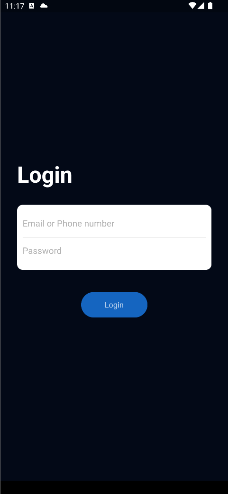

## Flutter Splash screen animation Application Design - Day 3

```dart
class Day7 extends Flutter100DaysOfCode {
  video() {
    return {
      "title": "Flutter Splash screen animation Application Design",
      "description": "Let's see how we can design a splash screen UI and add some animation.",
      "day": 7,
      "videoLink": "#"
    }
  }
}
```

<br>

## Previous Designs
[Checkout my LinkedIn page](https://www.linkedin.com/feed/update/urn:li:activity:7034470493072060416/)
<br>

## Development Setup
Clone the repository and run the following commands:
```
flutter pub get
flutter run
```


## ScreenShot

&nbsp;&nbsp;&nbsp;


## Links
* [LinkedIn](https://www.linkedin.com/in/patrick-wilfried-kamelan-2b388a115/)
* [Twitter](https://twitter.com/KamelanPatrick)
* [Instagram](https://www.instagram.com/patrickispoppin/)
